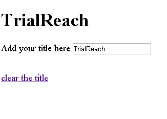

# ANTIDOTE JAVASCRIPT ASSESSMENT

## Task

Imagine that you have to build a framework that will be used by thousands of developers. We will give you 24 hours for implementing the following features:

- templating
- event handling
- two-way binding implemented within the framework (bonus points if you finish with this one)

Develop the features as separate modules (parts) of the framework and write functional tests for them. Feel free to use your favorite testing framework. Just let us know how to run the tests. You are not allowed to use any third party libraries like jQuery, lodash or underscore. No frameworks either.

The final result should look like that (please ignore the fact that the title is TrialReach instead of Antidote):



## The base

Here is the HTML file that you will start from:

```html
<!DOCTYPE html>
<html>
  <head>
    <script src="Framework.js"></script>
  </head>
  <body>
    <div class="content"></div>

    <script type="template/framework" id="header-template">
      <header>
        <h1>{{title}}</h1>
        <form>
          <label for="title">Add your title here</label>
          <input type="text" id="title" data-event="keyup:titleChanged" value="{{title}}" />
        </form>
        <a href="#" data-event="click:clearTitle">clear the title</a>
      </header>
    </script>

    <script>
      var header = Framework.create({
        template: '#header-template',
        data: {
          title: 'Antidote'
        },
        clearTitle: function(e) {
          document.querySelector('input').value = '';
          document.querySelector('h1').innerHTML = '';
        },
        titleChanged: function(e) {
          document.querySelector('h1').innerHTML = e.target.value;
        }
      });
      header.render('.content');
    </script>
  </body>
</html>
```

Please, do not change the content of `index.html` (the base). The idea is to fill the content of `Framework.js` and make the things work without touching the code in the script tags.

### Templating

The HTML template is placed in a script tag. You should fetch the markup from there based on the `id`. Your framework should has only one public method called `create`. It should accept an object literal with the following characteristics:

- `data` - all the properties of this object may be used in the template in the format of `{{property name}}`
- custom functions - functions that will be called in a response of DOM events

### Event handling

The events that we are interested in should be described in `data-event` attributes. The format is `eventname:customfunction`.

## Hosting

Please create a repository in GitHub and host your work there. Think about this little library as something that you are sharing with dozen of people. They should be able to start using the framework by simply reading the README of the project. And please make as many commits as possible. We want to see the progress of your work.

## Additions

- Don't try to cover edge cases. We want to see how you think, how you construct your JavaScript applications. If your demo behaves like on the animated gif above we are happy.
- Don't think about browser specific issues. Make sure that your demo works in Chrome.
